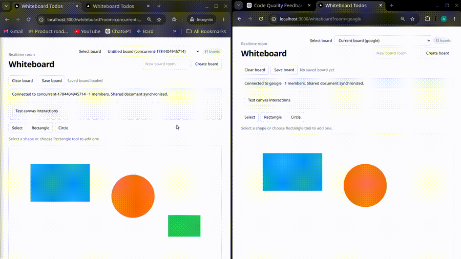

# Real-time collaborative whiteboard

A small Figma/Miro-style whiteboard built as a Bun workspace. The project
combines a Next.js App Router web app, a separate Bun + Elysia realtime server,
shared transport contracts, and PostgreSQL-backed persistence.

The current implementation includes canvas rendering and shape interaction,
room-based collaboration, live collaborator cursors, shared document updates,
saved-board persistence, and buffered snapshot flushing.

<video controls src="docs/videos/simplescreenrecorder-2026-07-19_02.00.27.mp4" title="Whiteboard demo"></video>



## Quick start

Requirements: [Bun](https://bun.sh/), Docker, and Docker Compose.

```sh
bun install
cp apps/web/.env.example apps/web/.env
bun run db:up
bun run db:push
bun run dev
```

Open [http://localhost:3000](http://localhost:3000). The realtime process
exposes its health check at [http://localhost:3001/health](http://localhost:3001/health).

Stop the local database with:

```sh
bun run db:down
```

## Useful commands

```sh
bun run test          # unit tests
bun run test:e2e      # Playwright browser tests
bun run typecheck
bun run lint
bun run build
```

## Repository map

- `apps/web` — Next.js UI, canvas features, tRPC route, ZenStack/Prisma data boundary
- `apps/realtime` — Bun + Elysia WebSocket server, rooms, presence, and persistence buffering
- `packages/contracts` — shared Zod schemas and document/transport types
- `tests/e2e` — browser-level collaboration and persistence workflows
- `docs/slices` — implementation-ready design documents for each capability

The web application uses tRPC through the single App Router adapter at
`apps/web/src/app/api/trpc/[trpc]/route.ts`; feature-specific API routes and
server actions are intentionally out of scope. `apps/web/schema.zmodel` is the
authoritative persisted-model and policy definition, while generated artifacts
should be regenerated with `bun run db:generate` after schema changes.

## Project references

- [Implementation slices](docs/01.implementation-slices.md) — capability order, constraints, and verification criteria
- [Repository structure](docs/02.repo-Structure.md) — ownership boundaries and workspace layout
- [Dependency trade-offs](docs/03.dependency-management-and-engineering-trade-offs.md) — why significant packages are used or deferred
- [Product specification](project-specification.md) — requirements and acceptance goals
- [Notes](notes.md) — lessons, debugging discoveries, and decisions worth preserving

`AGENTS.md` contains contributor and agent workflow instructions. It is useful
when making changes, while this README is the shorter orientation and setup
guide.
